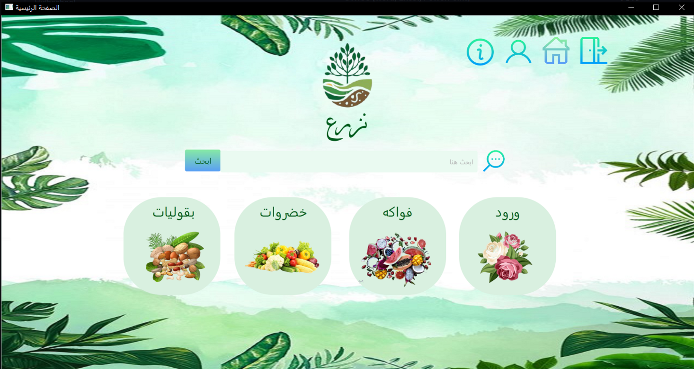

# 🌿 Nazraa - Smart Planting Guide

Nazraa is a desktop application built using JavaFX to help users learn how to plant various types of crops. Whether you want to grow fruits, vegetables, legumes, or flowers, Nazraa provides clear guidance and planting instructions.

---

## 🖼️ Screenshot



---

## 🌱 Features

- 🌽 Browse categories: Fruits, Vegetables, Legumes, and Flowers
- 🔍 Search for specific plants
- 📋 View detailed information about plant needs:
  - Soil type
  - Water requirements
  - Ideal temperature
  - Suitable climate
- 🧑‍🌾 Save your selected plants to **"My Crops"**

---

## 🛠️ Built With

- Java
- JavaFX
- SceneBuilder (FXML)
- (Optional) MySQL - for managing user data (future enhancements)

---

## 🚀 Getting Started

To run the project locally:

1. Clone the repository:
   ```bash
   git clone https://github.com/Maram-Metro/Nazraa_application.git

2. Open the project in your IDE (e.g., IntelliJ or Eclipse)

3. Make sure JavaFX libraries are properly configured.

4. Run the Main.java file to start the application.


Nazraa_application
├── src/
│   ├── application/         # Main Java files
│   ├── controllers/         # Controller classes for each scene
│   └── views/               # FXML files (SceneBuilder)
├── Nazraa_application.png   # Screenshot
└── README.md


📌 About
This project was developed as part of a learning journey to combine creativity with coding. The application serves as a helpful and aesthetic guide for anyone interested in gardening.

👩🏻‍💻 Author
Maram - GitHub Profile
🌐 Portfolio

